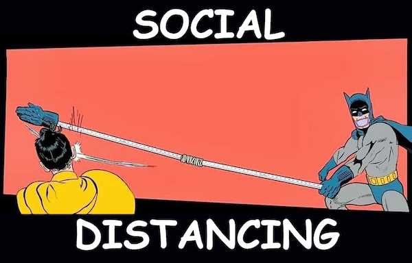

# Introduction :v:
Yes, this is another social distancing implementation. 

**How is it different?**  
:point_right: Easy to follow end-to-end workflow.  
:point_right: Super simple calibration.  
:point_right: Run locally using a [local detections file](https://github.com/FarrandTom/social-distancing/blob/master/data/labels/oxford_snipped_labels.json), or call an external inference service.  
:point_right: Already integrated into [IBM Visual Insights](https://www.ibm.com/products/ibm-visual-insights) for inference calls, and easy to rip and replace with another inference engine.

It is inspired by the fantastic work done by researchers at IIT-Pavis which you can find [here](https://github.com/IIT-PAVIS/Social-Distancing).

**Example output:**


# Get Up and Running! :running::dash:

1. Clone this repository  
`git clone https://github.com/FarrandTom/social-distancing.git`
2. Install the necessary packages in your virtual environment!  
`conda install --file requirements.txt` or `pip install -r requirements.txt`
3. Run `python main.py` to create an output video in `./data/results/output.mp4` based on a sample snippet of Oxford town centre saved at `./data/videos/oxford_snipped.mp4`

# Usage :bulb:

## Adding New Video :film_strip:
To add new videos you need to do the following:

## 1. Update the settings :toolbox:

The main configuration file is [`settings.json`](https://github.com/FarrandTom/social-distancing/blob/master/settings.json). This is where the bulk of user driven settings can be tweaked and changed. This repository comes pre-populated with settings which allow you to run the tool out of the box:
```
{
    "VIDEO_INPUT_PATH": "./data/videos/oxford_snipped.mp4",
    "VIDEO_OUTPUT_PATH": "./data/results/output.mp4",
    "CALIBRATION_COORDS_PATH": "./calibration_coords.json",
    "LOCAL_RUN": "True",
    "VISUAL_INSIGHTS_CREDS_PATH": "./placeholder_creds.json",
    "DETECTIONS_FILE": "./data/labels/oxford_snipped_labels.json",
    "PHYSICAL_DISTANCE": 100,
    "REFERENCE_HEIGHT": 22.5,
    "DPI": 300
}
```
The table below contains a description of each of the settings in more detail. 

| Name  | Description | Required? |
| ------------- | ------------- | ------------- |
| `VIDEO_INPUT_PATH`  | Path to the input video which will be processed.  | :ballot_box_with_check: |
| `VIDEO_OUTPUT_PATH`  | Path to where the output video will be saved.  | :ballot_box_with_check: |
| `CALIBRATION_COORDS_PATH`  | Path to the four calibration coordinates for the input video. If there is no existing calibration file then this path represents where the new file will be saved once the user has completed calibration.  | :ballot_box_with_check: |
| `LOCAL_RUN`  | Boolean flag ("True" or "False") indicating whether to use a local detections file (True), or upload the video file to a 3rd party inference service (False). Out of the box remote inference is supported by IBM Visual Insights. | :ballot_box_with_check: |
| `VISUAL_INSIGHTS_CREDS_PATH`  | If `LOCAL_RUN` is False, then this will be a path to a credentials file which supplies authentication to a 3rd party inference service.  | Only if `LOCAL_RUN` is False |
| `DETECTIONS_FILE`  | If `LOCAL_RUN` is True, then this will be a path to a .json file which supplies detected object coordinates and frame numbers. For an example [click here](https://github.com/FarrandTom/social-distancing/blob/master/data/labels/oxford_snipped_labels.json).  | Only if `LOCAL_RUN` is True|
| `PHYSICAL_DISTANCE` | The distance in cm required to maintain social distancing  | :ballot_box_with_check: |
| `REFERENCE_HEIGHT`  | The estimated real world height of detected objects in cm. In this case we are using head detections, and therefore estimate that the average head height is 22.5 cm. | :ballot_box_with_check: |
| `DPI`  | The quality of the output video in Dots Per Inch (DPI)   | :ballot_box_with_check: |

To allow the tool to infer on new videos you will have to change:
 - The `VIDEO_INPUT_PATH` to point to where the new video is saved. 
 - To make sure that new results do not overwrite old ones it may be wise to update the `VIDEO_OUTPUT_PATH`
 - Set a fresh `CALIBRATION_COORDS_PATH` (even if you have not yet set the calibration coordinates) which is different from any previous calibration files. This new path will be where the calibration coordinates are then saved and re-used in the future. Move on all this in step 2 below.
 - If you are running in local mode (`LOCAL_RUN: "True"`) then you will have to supply a new `DETECTIONS_FILE` for the new video. You can see an example of these detections [here](https://github.com/FarrandTom/social-distancing/blob/master/data/labels/oxford_snipped_labels.json).
 - If you are using a remote inference service (`LOCAL_RUN: "False"`) then nothing should have to change, unless you wish to update the back end detection model.
 - `PHYSICAL_DISTANCE`, `REFERENCE_HEIGHT`, and `DPI` are only going to be impacted by the change in input video if there is a change in the objects being detected (e.g. full body instead of only the head), or the business problem being solved (e.g. the physcial distance needs to be 200cm instead of 100cm). 

## 2. Calibrate :world_map:

The next thing required is to populate a calibration coordinates .json file. An example found [here](https://github.com/FarrandTom/social-distancing/blob/master/calibration_coords.json) is:  
`[[1129, 221], [1534, 267], [880, 953], [273, 755]]`

The calibration coordinates are simply the four corner points of a rectangle. This rectangle is used to generate the bird's-eye view perspective you can see in the GIF above. 

When using a new video you will need to generate new calibration coordinates- these will be written to, and subsequently read from, `CALIBRATION_COORDS_PATH`. 

To kick off calibration simply run `python main.py`, in your virtual environment, using a `CALIBRATION_COORDS_PATH` which currently does not exist.  Your terminal will then display:

```
-------------------------------------------
No existing calibration file found. 
You will now be prompted to calibrate the system. 
The system expects four points in the shape of a rectangle which it uses as reference coordinates to calculate the bird's-eye perspective. 
The rectangle should lie in line with the geometry of the video e.g. if there is a road running through the centre of your video, the rectangle should mirror the road's orientation. 
--------------------------------------------------------- 
There are two main assumptions to bear in mind with this implementation: 
1) The ground is a flat plane. 
2) The camera viewpoint is in a fixed position. 
--------------------------------------------------------- 
The first frame of the input video will now be displayed. 
Simply click where you wish the four corners of the calibration rectangle to be- a green dot will be placed wherever you click. 
Your calibration coordinates will be saved at ./test.json 
---------------------------------------------------------
```

As you then click on the first frame of your video, each of the coordinates that you select will also be printed to the terminal:
```
280 749
902 916
1518 287
1121 226
```

As soon as you have selected four points, the script will move on to the inference and drawing steps! :art:

*Note: If you make a mistake simply quit the script (cmd/ctrl + C), delete any .json file that has been created, and start again.*

## 3. Infer :hourglass_flowing_sand:

If you are using detections from a local file then you will simply need to point the `DETECTIONS_FILE` variable towards that local file. Depending on the format of that local file you may need to tweak the `sort_detections` function found [here](https://github.com/FarrandTom/social-distancing/blob/master/inference/detect.py#L159). 

If you have access to an [IBM Visual Insights](https://www.ibm.com/products/ibm-visual-insights) instance then the [`placeholder_creds.json`](https://github.com/FarrandTom/social-distancing/blob/master/placeholder_creds.json) file can be easily tweaked to support your credentials: 
```
{
    "credentials": {
        "hostname" : "<Your hostname here>",
        "Auth"    : [ "<Your username here>", "<Your password here>" ],
        "logLevel": 40
},
    "model_id": "<Your model ID here>"
}
```

Your `model_id` can be found via the [Visual Insights API](http://public.dhe.ibm.com/systems/power/docs/powerai/api120.html) or when selecting a deployed model in the GUI it will be displayed in the deployed model API endpoint e.g. `https://9.196.150.153/visual-insights/api/dlapis/a17d62c5-3087-4b34-9899-6f58da4da99d` --> `"model_id": a17d62c5-3087-4b34-9899-6f58da4da99d`.

If you wish to perform inference against a different service then the API calls within [`detect.py`](https://github.com/FarrandTom/social-distancing/blob/master/inference/detect.py) will have to be adapted to support the new API. I'll leave that up to you :)

That's it, you're ready to go. :boom:

# References :book:
Special thanks to Bob Cheesebrough for his pointers while building this out!

1. https://github.com/IIT-PAVIS/Social-Distancing
2. https://www.pyimagesearch.com/2014/08/25/4-point-opencv-getperspective-transform-example/
3. http://www.robots.ox.ac.uk/ActiveVision/Research/Projects/2009bbenfold_headpose/project.html
4. https://www.pyimagesearch.com/2016/03/21/ordering-coordinates-clockwise-with-python-and-opencv/


